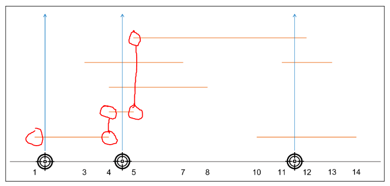

#### 풀이 1. 정렬 + 완전 탐색

좌표의 뒷 번호를 우선순위로 정렬한다. 그 후에 모든 좌표를 돌면서 각 좌표의 범위가 끊기는 지점을 찾아 answer += 1을 해준다.



```python
def solution(targets):
    answer = 0
    
    targets.sort(key = lambda x: [x[1], x[0]])

    target_in = 0
    for t in targets:
        if t[0] >= target_in:
            answer += 1
            target_in = t[1]
    
    return answer
```


풀이 시간 : 60분

---

#### 새롭게 알게된 점

- (있으면 작성)

#### 어려웠던 점

- (있으면 작성)
